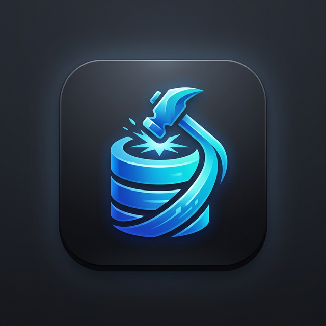

# Data Forge v1.4.0

**Data Forge** is an enterprise-grade, high-performance database management studio and AI-powered SQL editor. Built with **Next.js** and **Electron**, it offers a sophisticated **"Nebula" aesthetic**—a premium, immersive interface with deep grays, restrained accents, and glassmorphism.

Data Forge provides a unified, multi-tabbed workspace for **SQL Server (MSSQL)**, **PostgreSQL**, **MySQL**, and **MariaDB**, combining traditional administration power with modern AI intelligence and hardened security.



---

## 🚀 What's New in v1.4.0

### 🧠 Intelligent Querying & Filtering
- **Smart Filter Suggestions** — Replaced standard table filtering with a context-aware **Intelligent Filter**.
- **Contextual Autocomplete** — Real-time suggestions for table columns and SQL keywords (`AND`, `OR`, `LIKE`, etc.).
- **Productivity Boost** — Built-in keyboard navigation (Arrows + Enter/Tab) for rapid filter construction.

### 🍱 Branding & Identity
- **New App Icon** — The official high-resolution branding is now featured on the landing page.
- **Visual Refinement** — Polished feedback animations and improved empty states across the workspace.

### 🛠 Metadata Intelligence
- **Faster Suggestions** — Optimized cross-database schema loading for an even snappier SQL editor experience.

---

## 🚀 Previously in v1.3.0

### 🖥️ Desktop & Electron Stability
- **MSSQL Update Fix** — Resolved `rowsAffected` return issues in Electron.
- **Smart Table Resolution** — Enforced 3-part naming for all MSSQL updates.
- **Execution Plan Repair** — Fixed client-side exceptions during plan analysis.

---

## 🚀 Previously in v1.2.1

### 🛡️ Production Safety & Environment Management
- **Environment Color Coding** — Assign colors (Red/Orange/Green/Purple) to connections for visual safety.
- **Read-Only Mode** — Enforce `SELECT`-only guards per connection. Destructive queries are blocked at the API level with comment-bypass protection.
- **Safety Banner** — Persistent visual indicators when connected to sensitive or read-only environments.

### 💅 SQL Linter & Formatter
- **Real-Time Linter** — Analyzes SQL as you type with 10 best-practice rules (e.g., Missing WHERE, SELECT * risk).
- **One-Click Formatter** — Professional SQL restructuring via `Cmd+Shift+F`.
- **Collapsible Lint Panel** — Interactive issue tracker with "jump-to-line" badges.

### 🕵️ Data Masking (Privacy & Compliance)
- **Auto-Detection** — 30+ patterns identify PII (Emails, Phones, SSNs, CCs) automatically.
- **Smart Masking** — Contextual masks (e.g., `jo•••@domain`) applied by default in result grids.
- **Click-to-Reveal** — Securely peek at individual values without exposing the entire dataset.

### 🗑️ Bulk Row Deletion
- **Checkbox Selection** — Select individual rows or all rows via the header checkbox.
- **Drop Rows Button** — Deletes selected rows using dialect-aware `DELETE` statements with smart primary key detection.
- Works correctly across MSSQL, PostgreSQL, MySQL, and MariaDB with proper date/boolean type handling.

---

## 📋 Full Feature List

### 🗂 Core Workspace & Connectivity
- **Multi-Tab Workspace** — Query, Table, Designer, ER Diagram, Monitor, and Tool tabs in a single window.
- **Tab Persistence** — Open tabs and queries are saved and restored per connection.
- **"Close All Tabs"** — One-click cleanup of the workspace with confirmation safety.
- **Auto-Connect** — One-click connection using "Save in System" credentials from the dashboard.
- **Connection String Mode** — Paste full URIs (`postgresql://`, `mysql://`, etc.) without filling each field manually.
- **Multi-Window / Pop-Out** — Pop any tab into an independent browser window.

### 📊 Data Utility
- **Data Export Engine** — Export results to CSV, JSON, Excel (XLSX), or `INSERT` SQL scripts (MSSQL / PostgreSQL dialect).
- **Import Wizard** — Bulk import CSV / JSON into existing tables with column mapping.
- **Schema DDL Generator** — Generate `CREATE` scripts for any Table, View, or Procedure.

### ⌨️ SQL Editor
- **Monaco Editor** — Full VS-Code-style editor with syntax highlighting, IntelliSense, bracket matching, and multi-cursor.
- **Cross-DB IntelliSense** — Auto-completes tables, views, procedures, and columns across all explored databases simultaneously.
- **Query History** — Persistent searchable log of the last 100 executed queries.
- **Query Bookmarks** — Save and recall frequently used snippets with custom names.
- **Execution Plan Viewer** — Visual hierarchical plan tree for `EXPLAIN` / `SET STATISTICS PROFILE`.
- **AI Copilot (Cmd+K)** — Schema-aware natural language to SQL generation overlay.
- **SQL Formatter (Cmd+Shift+F)** — Format any query with uppercase keywords and clean indentation.
- **Real-Time SQL Linter** — Continuous best-practice checks as you type.

### 🤖 AI Intelligence
- **Multi-Provider AI** — OpenAI, Anthropic, Gemini, Z.ai, and Ollama (Local LLM).
- **AI SQL Fixer** — Multi-step error analysis and correction.
- **Performance Advisor** — Analyze execution plans; get AI-powered index recommendations.
- **"Explain with AI"** — Human-readable breakdown of complex execution plans.
- **Safety First Mode** — Always preview SQL before auto-execution.

### 🏗 Schema Designers
- **Visual Table Designer** — Manage columns, types, nullability, PKs, FKs, indexes, and constraints visually.
- **View Designer** — Build views with a query editor and column alias manager.
- **Procedure & Function Designer** — Parameter definitions, templates, and body editor.
- **Visual Query Builder** — Drag-and-drop table fields and join manager.
- **ER Diagram** — Auto-generate interactive entity-relationship graphs from live foreign keys.

### 🏢 Enterprise Tools
- **Schema Comparison** — Diff two database schemas and generate migration scripts.
- **Server Health Monitor** — Real-time CPU / memory / active sessions tracking.
- **User & Permission Manager** — Visual UI for DB users, roles, and granular permissions.
- **Mock Data Generator** — Generate thousands of realistic dummy rows (emails, names, UUIDs, dates) with auto-detected column types.
- **Mini Dashboards** — Save Bar / Line / Pie charts from result sets into a persistent dashboard board.

### 🛡️ Safety & Compliance
- **Universal Encryption** — AES-GCM encryption for all sensitive data (History, Bookmarks, AI Keys).
- **Environment Color Coding** — Visual connection environment tagging (Production/Staging/Dev/Analytics).
- **Read-Only Mode** — Server-side enforcement of SELECT-only policy per connection.
- **Data Masking** — Automatic PII/sensitive data masking in result grids with click-to-reveal.
- **SQL Linter** — Real-time detection of dangerous or inefficient SQL patterns.

---

## 🛠 Tech Stack

| Layer | Technology |
|---|---|
| **Framework** | [Next.js](https://nextjs.org/) (App Router, Static Export) |
| **Desktop Wrapper** | [Electron](https://www.electronjs.org/) |
| **SQL Editor** | [Monaco Editor](https://microsoft.github.io/monaco-editor/) |
| **Charts** | [Recharts](https://recharts.org/) |
| **Styling** | Vanilla CSS (Theme-aware) & Tailwind CSS |
| **Drivers** | `tedious` (MSSQL), `pg` (PostgreSQL), `mysql2` (MySQL/MariaDB) |

---

## 📦 Getting Started

### Installation & Development

1. Clone and install:
   ```bash
   git clone https://github.com/nucrasenaa/db-editor.git
   cd db-editor
   yarn install
   ```

2. Run environment:
   ```bash
   yarn dev           # Web Version (http://localhost:3000)
   yarn electron-dev  # Electron Desktop Version
   ```

### Build & Packaging

| Command | Output |
|---|---|
| `yarn build-mac` | macOS `.dmg` + `.zip` |
| `yarn build-win` | Windows `.exe` installer + `.zip` |
| `yarn build-all` | Universal Build |

---

## 🔒 Security & Architecture

- **Native IPC Core** — Critical database and AI logic is executed in the Electron Main process via IPC handlers.
- **Universal Encryption Layer** — Sophisticated encryption using Electron `safeStorage` and Web Crypto (AES-GCM).
- **Hardened Credential Safety** — Passwords and API keys are encrypted at rest with automatic migration.
- **Context Isolation** — Hardened security using `contextBridge` to prevent renderer-to-main vulnerabilities.
- **Read-Only Enforcement** — Backend API blocks destructive queries when Read-Only mode is enabled.
- **Comment-Bypass Protection** — Advanced SQL comment stripping prevents bypass attempts.

---

## 📄 Developers

**THREE MAN DEV** © 2026. ALL RIGHTS RESERVED.  
BANGKOK, THAILAND

## 📄 License

MIT License.
